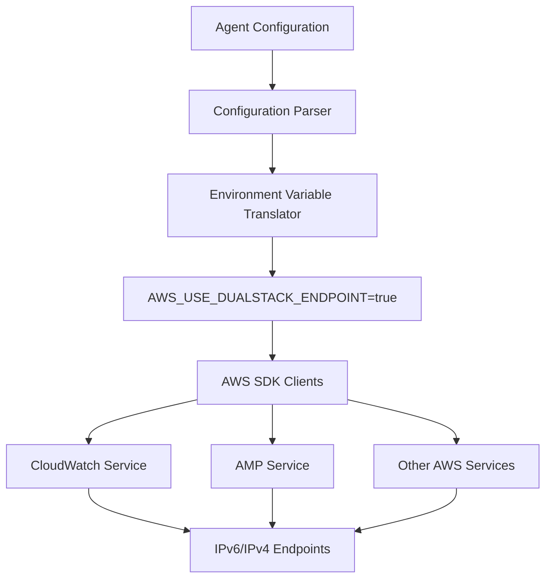

# Design Document

## Overview

The IPv6 dual-stack support feature enables the Amazon CloudWatch Agent to communicate with AWS services over both IPv4 and IPv6 networks. This design leverages AWS SDK's built-in dual-stack endpoint support through the `AWS_USE_DUALSTACK_ENDPOINT` environment variable, ensuring consistent behavior across all AWS service clients within the agent.

The implementation follows a configuration-driven approach where users can enable dual-stack support through the agent's JSON configuration, which is then translated to the appropriate environment variable that AWS SDK clients automatically recognize and use.

## Architecture

### High-Level Architecture



### Component Interaction Flow

1. **Configuration Input**: User specifies `"use_dualstack_endpoint": true` in agent configuration
2. **Configuration Translation**: Agent configuration parser processes the dual-stack setting
3. **Environment Variable Setting**: Configuration translator sets `AWS_USE_DUALSTACK_ENDPOINT=true`
4. **SDK Client Initialization**: All AWS SDK clients automatically detect the environment variable
5. **Endpoint Resolution**: AWS SDK clients use dual-stack endpoints for all AWS service calls
6. **Network Communication**: Services communicate over IPv6 when available, falling back to IPv4

## Components and Interfaces

### 1. Configuration Parser (`translator/translate/agent/use_dualstack_endpoint.go`)

**Purpose**: Parses the `use_dualstack_endpoint` configuration field and stores it in the global configuration.

**Interface**:
```go
type UseDualStackEndpoint struct {}

func (r *UseDualStackEndpoint) ApplyRule(input interface{}) (string, interface{})
```

**Responsibilities**:
- Validate boolean input for dual-stack configuration
- Store configuration in `Global_Config.UseDualStackEndpoint`
- Return configuration key-value pair for further processing

### 2. Environment Variable Translator (`translator/tocwconfig/toenvconfig/toEnvConfig.go`)

**Purpose**: Translates agent configuration to environment variables that AWS SDK clients can consume.

**Interface**:
```go
func ToEnvConfig(jsonConfigValue map[string]interface{}) []byte
```

**Responsibilities**:
- Read dual-stack configuration from agent section
- Set `AWS_USE_DUALSTACK_ENDPOINT` environment variable when enabled
- Generate JSON configuration for environment variables

### 3. CloudWatch Plugin (`plugins/outputs/cloudwatch/cloudwatch.go`)

**Purpose**: CloudWatch metrics output plugin that benefits from dual-stack endpoint support.

**Key Integration Points**:
- AWS SDK client initialization automatically uses dual-stack endpoints when environment variable is set
- No code changes required in the plugin itself due to AWS SDK's automatic environment variable detection
- Dynamic User-Agent handler integration for service identification

### 4. AMP Integration (`translator/translate/otel/exporter/prometheusremotewrite/translator.go`)

**Purpose**: Amazon Managed Prometheus integration that constructs dual-stack endpoints.

**Key Features**:
- Uses `agent.Global_Config.UseDualStackEndpoint` to determine endpoint domain
- Constructs AMP endpoints with appropriate domain (`api.aws` for dual-stack, `amazonaws.com` for IPv4-only)
- Automatic endpoint resolution based on configuration

## Data Models

### Configuration Schema

```json
{
  "agent": {
    "use_dualstack_endpoint": true
  }
}
```

### Environment Variable Output

```json
{
  "AWS_USE_DUALSTACK_ENDPOINT": "true"
}
```

### Global Configuration Structure

```go
type GlobalConfig struct {
    UseDualStackEndpoint bool
    // other fields...
}
```

## Error Handling

### Configuration Validation

1. **Invalid Input Type**: If `use_dualstack_endpoint` is not a boolean, return `translator.ErrorMessages`
2. **Missing Configuration**: Default to `false` (IPv4-only) for backward compatibility
3. **Environment Variable Setting**: Log warnings if environment variable cannot be set

### Network Fallback

1. **IPv6 Unavailable**: AWS SDK automatically falls back to IPv4 endpoints
2. **Dual-Stack Endpoint Failure**: AWS SDK retries with IPv4-only endpoints
3. **DNS Resolution Issues**: Standard AWS SDK retry logic applies

### Service Integration

1. **CloudWatch Plugin**: Existing error handling and retry mechanisms remain unchanged
2. **AMP Integration**: Endpoint construction errors logged and service initialization fails gracefully
3. **SDK Client Errors**: Standard AWS SDK error handling and logging applies

## Testing Strategy

### Unit Tests

1. **Configuration Parser Tests**:
   - Test valid boolean input (true/false)
   - Test invalid input types
   - Verify global configuration setting

2. **Environment Variable Translator Tests**:
   - Test dual-stack enabled scenario
   - Test dual-stack disabled scenario
   - Test missing configuration scenario
   - Verify correct JSON output format

3. **AMP Endpoint Construction Tests**:
   - Test dual-stack endpoint generation
   - Test IPv4-only endpoint generation
   - Verify correct domain selection

### Integration Tests

1. **CloudWatch Plugin Integration**:
   - Test plugin initialization with dual-stack enabled
   - Verify AWS SDK client configuration
   - Test User-Agent handler integration

2. **Configuration Translation Integration**:
   - Test end-to-end configuration processing
   - Verify environment variable propagation
   - Test configuration file parsing

### Network Tests

1. **Endpoint Resolution Tests**:
   - Mock dual-stack endpoint responses
   - Test IPv6/IPv4 fallback behavior
   - Verify correct endpoint selection

2. **Service Communication Tests**:
   - Test CloudWatch metrics submission with dual-stack
   - Test AMP remote write with dual-stack endpoints
   - Verify backward compatibility with IPv4-only networks

## Implementation Considerations

### Backward Compatibility

- Default behavior remains IPv4-only when dual-stack is not configured
- Existing configurations continue to work without modification
- No breaking changes to existing APIs or interfaces

### Performance Impact

- Minimal performance overhead from environment variable checking
- AWS SDK handles endpoint resolution efficiently
- No additional network calls or latency introduced by the feature

### Security Considerations

- Dual-stack endpoints use the same authentication and authorization mechanisms
- TLS/SSL encryption applies to both IPv4 and IPv6 connections
- No additional security risks introduced by the feature

### Monitoring and Observability

- Existing CloudWatch Agent logging captures dual-stack configuration
- AWS SDK logs include endpoint resolution details
- User-Agent headers identify dual-stack capability for service monitoring