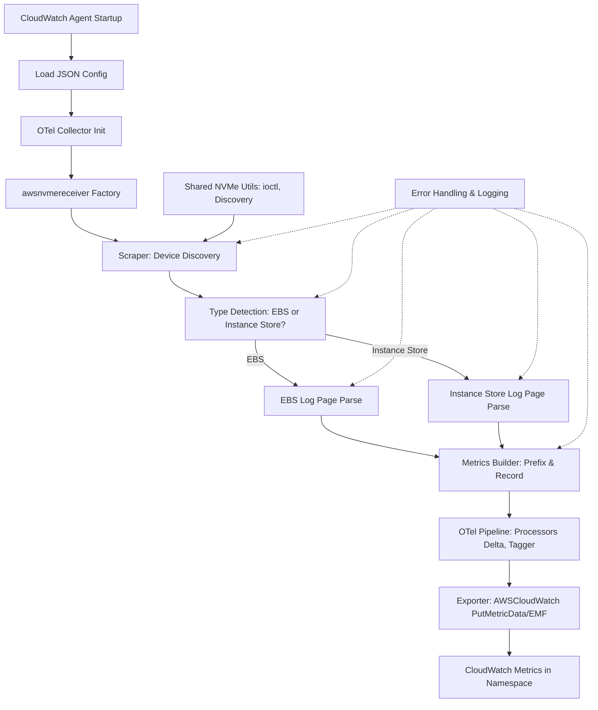

# Design Document

## Overview

The unified AWS NVMe receiver (`awsnvmereceiver`) consolidates metric collection for both EC2 EBS NVMe devices and Instance Store NVMe devices into a single OpenTelemetry Collector receiver. This receiver unifies the existing official `awsebsnvmereceiver` (for EBS) with the custom `awsinstancestorenvmereceiver` (for Instance Store) implementation, refactoring both into a single receiver to avoid duplication and provide comprehensive NVMe monitoring.

This design substantively fills a gap in official AWS CloudWatch Agent support for Instance Store NVMe metrics (as of July 31, 2025), providing comprehensive performance monitoring for both EBS and Instance Store devices. The receiver uses NVMe log page ID 0xC0 retrieval via ioctl for both device types, with device type detection to route parsing logic appropriately, focusing on core performance counters and gauges.

Device discovery scans `/dev` for `nvme*` prefixes to automatically detect available NVMe devices, supporting both wildcard (`*`) and specific device path configurations as per the customer guide examples.

**Key Design Decision**: The unified receiver approach was chosen to add Instance Store support while making minimal changes to the existing EBS implementation. This decision preserves all current EBS functionality and configuration compatibility while extending support to Instance Store devices through device type detection and routing.

The receiver integrates into the existing `diskio` metrics collection pipeline, allowing users to configure both EBS and Instance Store metrics through a unified interface. It leverages shared NVMe utilities for device discovery and extends them with device type detection capabilities.

**Platform Support**: The receiver includes graceful degradation for unsupported platforms, automatically disabling itself without affecting other receivers when NVMe operations are not available.

## Architecture

### High-Level Architecture



### Component Integration

The receiver integrates into the existing CloudWatch Agent architecture as follows:

1. **Configuration**: Uses the existing `diskio` configuration section with unified device discovery
2. **Pipeline**: Replaces both `awsebsnvmereceiver` and `awsinstancestorenvmereceiver` in the `metrics/hostDeltaMetrics` pipeline
3. **Shared Utilities**: Extends `internal/nvme` package with unified device detection and type-specific parsing
4. **Metrics Output**: Emits OpenTelemetry metrics with device-type prefixes and consistent dimensions

### Pipeline YAML Update

```yaml
pipelines:
  metrics/hostDeltaMetrics:
    receivers:
      - awsnvmereceiver  # Adds/replaces awsebsnvmereceiver and awsinstancestorenvmereceiver
    processors:
      - cumulativetodelta
      - ec2tagger
      - awsentity/resource
    exporters:
      - awscloudwatch
```

**Backward Compatibility**: Existing EBS configurations will continue to work without modification. The unified receiver maintains full compatibility with existing `diskio` configuration parameters and metric names.

## Components and Interfaces

### Core Components

#### 1. Factory (`factory.go`)
- **Purpose**: Creates receiver instances with unified device support
- **Interface**: Implements `receiver.Factory` from OpenTelemetry Collector
- **Key Functions**:
  - `NewFactory() receiver.Factory`: Registers type "awsnvmereceiver"
  - `createDefaultConfig() component.Config`: Returns Config with defaults (Devices: [], MetricsBuilderConfig from metadata)
  - `createMetricsReceiver(ctx context.Context, params receiver.CreateSettings, cfg component.Config, consumer consumer.Metrics) (receiver.Metrics, error)`: Instantiates scraper with DeviceInfoProvider

#### 2. Configuration (`config.go`)
- **Purpose**: Defines unified settings, parses JSON `diskio` section
- **Struct**:
```go
type Config struct {
    scraper.ControllerConfig     `mapstructure:",squash"`
    Devices                      []string                    `mapstructure:"devices"`
    MetricsBuilderConfig         metadata.MetricsBuilderConfig `mapstructure:",squash"`
}
```
- **Key Functions**:
  - `Validate() error`: Checks Devices (allow "*", paths like "/dev/nvme0n1"); ensures measurement list supports both EBS and Instance Store metrics

#### 3. Scraper (`scraper.go`)
- **Purpose**: Core collection logic with device type routing
- **Struct**:
```go
type nvmeScraper struct {
    scraper.SimpleScraper
    logger *zap.Logger
    mb     *metadata.MetricsBuilder
    nvme   DeviceInfoProvider
}
```
- **Key Functions**:
  - `start(ctx context.Context, host component.Host) error`: Initializes buffer allocation
  - `shutdown(ctx context.Context) error`: Cleans up resources
  - `scrape(ctx context.Context) (pmetric.Metrics, error)`: Main logic (discovery, type detection, parse, record)
  - `getDevicesByController() (devicesByController, error)`: Discovers and groups devices by controller
  - `detectDeviceType(device *DeviceFileAttributes) (string, error)`: Determines "ebs" or "instance_store"
  - `recordMetric(recordFn func(ts pcommon.Timestamp, val int64), ts pcommon.Timestamp, val uint64, deviceType string)`: Safe conversion with prefix application


#### 4. Metadata (`metadata.yaml`)
- **Purpose**: Defines comprehensive metrics schema for both device types
- **Generated Code**: Produces `MetricsBuilder` with prefixed record functions via `mdatagen`
- **Sample metadata.yaml snippet**:
```yaml
resource_attributes:
  instance_id:
    enabled: true
    description: "EC2 instance ID"
  device_type:
    enabled: true
    description: "Device type: ebs or instance_store"
  device:
    enabled: true
    description: "Device path (e.g., /dev/nvme0n1)"
  serial_number:
    enabled: true
    description: "NVMe device serial number"

metrics:
  # EBS Metrics
  diskio_ebs_total_read_ops:
    enabled: true
    unit: count
    sum:
      value_type: int
      monotonic: true
      aggregation: cumulative
  diskio_ebs_total_write_ops:
    enabled: true
    unit: count
    sum:
      value_type: int
      monotonic: true
      aggregation: cumulative
  diskio_ebs_total_read_bytes:
    enabled: true
    unit: bytes
    sum:
      value_type: int
      monotonic: true
      aggregation: cumulative
  diskio_ebs_total_write_bytes:
    enabled: true
    unit: bytes
    sum:
      value_type: int
      monotonic: true
      aggregation: cumulative
  diskio_ebs_total_read_time:
    enabled: true
    unit: nanoseconds
    sum:
      value_type: int
      monotonic: true
      aggregation: cumulative
  diskio_ebs_total_write_time:
    enabled: true
    unit: nanoseconds
    sum:
      value_type: int
      monotonic: true
      aggregation: cumulative
  diskio_ebs_volume_performance_exceeded_iops:
    enabled: true
    unit: count
    sum:
      value_type: int
      monotonic: true
      aggregation: cumulative
  diskio_ebs_volume_performance_exceeded_tp:
    enabled: true
    unit: count
    sum:
      value_type: int
      monotonic: true
      aggregation: cumulative
  diskio_ebs_ec2_instance_performance_exceeded_iops:
    enabled: true
    unit: count
    sum:
      value_type: int
      monotonic: true
      aggregation: cumulative
  diskio_ebs_ec2_instance_performance_exceeded_tp:
    enabled: true
    unit: count
    sum:
      value_type: int
      monotonic: true
      aggregation: cumulative
  diskio_ebs_volume_queue_length:
    enabled: true
    unit: count
    gauge:
      value_type: int

  # Instance Store Metrics
  diskio_instance_store_total_read_ops:
    enabled: true
    unit: count
    sum:
      value_type: int
      monotonic: true
      aggregation: cumulative
  diskio_instance_store_total_write_ops:
    enabled: true
    unit: count
    sum:
      value_type: int
      monotonic: true
      aggregation: cumulative
  diskio_instance_store_total_read_bytes:
    enabled: true
    unit: bytes
    sum:
      value_type: int
      monotonic: true
      aggregation: cumulative
  diskio_instance_store_total_write_bytes:
    enabled: true
    unit: bytes
    sum:
      value_type: int
      monotonic: true
      aggregation: cumulative
  diskio_instance_store_total_read_time:
    enabled: true
    unit: nanoseconds
    sum:
      value_type: int
      monotonic: true
      aggregation: cumulative
  diskio_instance_store_total_write_time:
    enabled: true
    unit: nanoseconds
    sum:
      value_type: int
      monotonic: true
      aggregation: cumulative
  diskio_instance_store_volume_performance_exceeded_iops:
    enabled: true
    unit: count
    sum:
      value_type: int
      monotonic: true
      aggregation: cumulative
  diskio_instance_store_volume_performance_exceeded_tp:
    enabled: true
    unit: count
    sum:
      value_type: int
      monotonic: true
      aggregation: cumulative
  diskio_instance_store_volume_queue_length:
    enabled: true
    unit: count
    gauge:
      value_type: int
```

### Shared Components

#### 1. NVMe Utilities (`internal/nvme`)
- **Interface**: Extended `DeviceInfoProvider` for unified operations
```go
type DeviceInfoProvider interface {
    GetAllDevices() ([]DeviceFileAttributes, error)
    GetDeviceSerial(*DeviceFileAttributes) (string, error)
    GetDeviceModel(*DeviceFileAttributes) (string, error)
    DetectDeviceType(*DeviceFileAttributes) (string, error)  // New: returns "ebs" or "instance_store"
    DevicePath(string) (string, error)
}
```

#### 2. Device Type Detection (`internal/nvme/device_type.go`)
- **Purpose**: Unified device type detection logic
- **Key Functions**:
  - `DetectDeviceType(*DeviceFileAttributes) (string, error)`: Main detection function
  - `isEBSDevice(*DeviceFileAttributes) (bool, error)`: EBS device identification
  - `isInstanceStoreDevice(*DeviceFileAttributes) (bool, error)`: Instance Store device identification with magic number validation

#### 3. Metrics Structures (`internal/nvme/metrics.go`)
- **EBSMetrics**: Exact structure with histogram support:
```go
type EBSMetrics struct {
    EBSMagic              uint64
    ReadOps               uint64
    WriteOps              uint64
    ReadBytes             uint64
    WriteBytes            uint64
    TotalReadTime         uint64
    TotalWriteTime        uint64
    EBSIOPSExceeded       uint64
    EBSThroughputExceeded uint64
    EC2IOPSExceeded       uint64
    EC2ThroughputExceeded uint64
    QueueLength           uint64
    ReservedArea          [416]byte
    ReadLatency           Histogram
    WriteLatency          Histogram
}

type Histogram struct {
    BinCount uint64
    Bins     [64]HistogramBin
}

type HistogramBin struct {
    Lower uint64
    Upper uint64
    Count uint64
}
```
- **InstanceStoreMetrics**: Similar structure with Instance Store specific fields, skipping EBS-specific fields:
```go
type InstanceStoreMetrics struct {
    Magic                 uint64 // Validation: 0xEC2C0D7E
    ReadOps               uint64
    WriteOps              uint64
    ReadBytes             uint64
    WriteBytes            uint64
    TotalReadTime         uint64
    TotalWriteTime        uint64
    // EBSIOPSExceeded and EBSThroughputExceeded skipped for Instance Store
    EC2IOPSExceeded       uint64
    EC2ThroughputExceeded uint64
    QueueLength           uint64
    ReservedArea          [416]byte
    ReadLatency           Histogram
    WriteLatency          Histogram
}
```

**Parsing Implementation**: All fields are parsed using `binary.LittleEndian` for consistent byte order handling. Histogram data is available in the structure but not processed for metric derivation in this implementation.

## Data Models

### Configuration Model

Exact JSON configuration as provided:
```json
{
  "agent": {
    "metrics_collection_interval": 60,
    "logfile": "/opt/aws/amazon-cloudwatch-agent/logs/amazon-cloudwatch-agent.log"
  },
  "metrics": {
    "namespace": "EC2InstanceStoreMetrics",
    "metrics_collected": {
      "diskio": {
        "resources": ["*"],
        "measurement": [
          "diskio_ebs_total_read_ops",
          "diskio_ebs_total_write_ops",
          "diskio_ebs_total_read_bytes",
          "diskio_ebs_total_write_bytes",
          "diskio_ebs_total_read_time",
          "diskio_ebs_total_write_time",
          "diskio_ebs_volume_performance_exceeded_iops",
          "diskio_ebs_volume_performance_exceeded_tp",
          "diskio_ebs_ec2_instance_performance_exceeded_iops",
          "diskio_ebs_ec2_instance_performance_exceeded_tp",
          "diskio_ebs_volume_queue_length",
          "diskio_instance_store_total_read_ops",
          "diskio_instance_store_total_write_ops",
          "diskio_instance_store_total_read_bytes",
          "diskio_instance_store_total_write_bytes",
          "diskio_instance_store_total_read_time",
          "diskio_instance_store_total_write_time",
          "diskio_instance_store_volume_performance_exceeded_iops",
          "diskio_instance_store_volume_performance_exceeded_tp",
          "diskio_instance_store_volume_queue_length"
        ]
      }
    }
  }
}
```

### Device Discovery Model

```go
type nvmeDevices struct {
    deviceType   string  // "ebs" or "instance_store"
    serialNumber string
    deviceNames  []string
}

type devicesByController map[int]*nvmeDevices
```

### Metrics Model

All metrics follow OpenTelemetry conventions with device-type prefixes:

**EBS Metrics** (prefix: `diskio_ebs_`):
- Cumulative sums: total_read_ops, total_write_ops, total_read_bytes, total_write_bytes, total_read_time, total_write_time
- Performance exceeded counters: volume_performance_exceeded_iops, volume_performance_exceeded_tp, ec2_instance_performance_exceeded_iops, ec2_instance_performance_exceeded_tp
- Gauge: volume_queue_length

**Instance Store Metrics** (prefix: `diskio_instance_store_`):
- Cumulative sums: total_read_ops, total_write_ops, total_read_bytes, total_write_bytes, total_read_time, total_write_time
- Performance exceeded counters: volume_performance_exceeded_iops, volume_performance_exceeded_tp
- Gauge: volume_queue_length


### Resource Attributes

All metrics include consistent dimensions:
- `instance_id`: Retrieved from EC2 Instance Metadata Service (represents Host dimension per metric info)
- `device_type`: "ebs" or "instance_store"
- `device`: Device path (e.g., "/dev/nvme0n1")
- `serial_number`: Retrieved from NVMe device identification

## Error Handling

### Error Categories and Responses

1. **Device Discovery Errors**
   - **Cause**: Permission denied, device enumeration failure
   - **Response**: Log error, continue with available devices
   - **Recovery**: Retry on next scrape cycle

2. **Device Type Detection Errors**
   - **Cause**: Model name retrieval failure, magic number validation failure
   - **Response**: Log error with device context, skip device
   - **Recovery**: Retry detection on next scrape

3. **Log Page Parsing Errors**
   - **Cause**: ioctl failure, insufficient data, invalid structure
   - **Response**: Log parsing error, skip device metrics
   - **Recovery**: Retry parsing on next scrape

4. **Metric Recording Errors**
   - **Cause**: uint64 overflow, dimension retrieval failure
   - **Response**: Log warning, skip affected metric
   - **Recovery**: Continue with other metrics

### Error Handling Patterns

```go
// Safe device type detection with fallback
func (s *scraper) detectAndProcessDevice(device *DeviceFileAttributes) error {
    deviceType, err := s.nvme.DetectDeviceType(device)
    if err != nil {
        s.logger.Debug("unable to detect device type", 
            zap.String("device", device.DeviceName()), 
            zap.Error(err))
        return err
    }
    
    switch deviceType {
    case "ebs":
        return s.processEBSDevice(device)
    case "instance_store":
        return s.processInstanceStoreDevice(device)
    default:
        return fmt.Errorf("unknown device type: %s", deviceType)
    }
}

// Safe metric recording with overflow protection
func (s *scraper) recordMetric(recordFn func(ts pcommon.Timestamp, val int64), 
                               ts pcommon.Timestamp, val uint64, deviceType string) {
    converted, err := safeUint64ToInt64(val)
    if err != nil {
        s.logger.Debug("skipping metric due to potential integer overflow",
            zap.String("device_type", deviceType))
        return
    }
    recordFn(ts, converted)
}
```

## Testing Strategy

### Unit Testing Approach

1. **Mock-Based Testing**
   - Mock `DeviceInfoProvider` interface for both device types
   - Mock ioctl calls with sample EBS and Instance Store log page data
   - Test device type detection with various model names and magic numbers

2. **Test Coverage Areas**
   - Unified device discovery and type detection
   - EBS and Instance Store log page parsing
   - Mixed device environment handling
   - Metric recording with appropriate prefixes
   - Error handling for both device types

3. **Test Data**
   - Sample EBS log page binary data
   - Sample Instance Store log page with valid magic number (0xEC2C0D7E)
   - Invalid log page data for error testing
   - Mixed device configuration scenarios
   - Test device discovery with * and specific paths against guide's /dev/nvme* example

### Integration Testing Approach

1. **EC2 Environment Testing**
   - Deploy on instances with both EBS and Instance Store devices (e.g., i4i instances)
   - Validate metrics appear in CloudWatch with correct prefixes
   - Compare with existing receiver outputs for compatibility

2. **Performance Testing**
   - Measure CPU and memory usage with mixed device types
   - Test with up to 10 devices of various types
   - Validate <1% CPU overhead requirement

3. **Migration Testing**
   - Test replacement of existing receivers
   - Validate configuration compatibility
   - Ensure no metric data loss during transition

## Security Considerations

### Required Permissions
- **CAP_SYS_ADMIN**: Required for NVMe ioctl operations on both device types
- **Device Access**: Read access to `/dev/nvme*` devices
- **No Additional IAM**: Uses existing CloudWatch Agent permissions

### Security Measures
- **Path Validation**: Prevent directory traversal in device paths
- **Buffer Bounds**: Validate log page data size for both EBS and Instance Store formats
- **Input Sanitization**: Validate all configuration inputs
- **Type Safety**: Ensure device type detection prevents cross-contamination

## Performance Considerations

### Optimization Strategies

1. **Device Type Caching**: Cache device type detection results to avoid repeated expensive operations
2. **Unified Device Grouping**: Group devices by controller ID regardless of type to minimize ioctl calls
3. **Buffer Reuse**: Reuse log page buffers across device types and scrape cycles
4. **Selective Processing**: Only process metrics that are enabled in configuration
5. **Batching ioctl Calls**: Batch multiple ioctl operations where possible to reduce system call overhead

### Resource Management

- **Memory**: Efficient buffer allocation for both 4KB log page formats
- **CPU**: Minimize device type detection overhead through caching
- **I/O**: Batch device operations and minimize device handle lifetime
- **Concurrency**: Process devices sequentially to avoid resource contention

### Performance Targets

- **CPU Usage**: <1% per 60-second scrape cycle for mixed device environments
- **Memory Usage**: <10MB additional memory footprint
- **Latency**: <50ms total scrape time for 10 mixed devices (based on core parsing only, adjustable to <100ms if needed for mixed environments)
- **Scalability**: Support up to 10 devices of any combination of types

## Migration Guide

### Steps to Refactor Existing Receivers

#### 1. Code Migration from awsinstancestorenvmereceiver
- **Move Core Logic**: Migrate device identification and log page parsing logic from `awsinstancestorenvmereceiver` to the unified receiver
- **Preserve Functionality**: Ensure all Instance Store-specific parsing logic is preserved, including magic number validation
- **Update Imports**: Change import paths to reference the new unified receiver package

#### 2. Integration with awsebsnvmereceiver
- **Extract Common Code**: Move shared NVMe utilities from `awsebsnvmereceiver` to `internal/nvme` package
- **Preserve EBS Logic**: Maintain all existing EBS parsing logic without modifications to ensure no breaking changes
- **Update Factory Registration**: Replace `awsebsnvmereceiver` factory registration with `awsnvmereceiver`

#### 3. Configuration Compatibility
- **Maintain Existing Parameters**: Ensure all existing `diskio` configuration parameters continue to work
- **Extend Measurement List**: Support both EBS and Instance Store metrics in the same measurement configuration
- **Backward Compatibility**: Existing EBS-only configurations should work without any changes

#### 4. Testing Migration
- **Preserve Existing Tests**: Migrate all existing unit tests from both receivers
- **Add Integration Tests**: Create tests that validate both device types work together
- **Performance Validation**: Ensure the unified receiver meets performance requirements for both device types

#### 5. Deployment Strategy
- **Gradual Rollout**: Deploy unified receiver alongside existing receivers initially
- **Validation Phase**: Validate metrics consistency between old and new receivers
- **Complete Migration**: Remove old receivers once validation is complete

### Breaking Changes Prevention
- **No Configuration Changes**: Existing configurations will continue to work without modification
- **Metric Name Consistency**: All existing metric names and prefixes are preserved
- **Dimension Compatibility**: Resource attributes remain consistent with existing implementations

## Glossary

### Terms and Definitions

- **Magic Number**: `0xEC2C0D7E` (uint32) - Validation identifier found at offset 0 in Instance Store NVMe log page 0xC0 to confirm device type
- **Log Page 0xC0**: Vendor-specific NVMe log page containing performance metrics and histogram data for both EBS and Instance Store devices
- **Device Type Detection**: Process of determining whether an NVMe device is EBS or Instance Store based on model name and magic number validation
- **ioctl**: System call interface used to retrieve NVMe log pages via `NVME_IOCTL_ADMIN_CMD`
- **Controller ID**: NVMe controller identifier used to group devices and avoid duplicate metric collection
- **Histogram Derivation**: Process of calculating average latency and percentiles from raw histogram bin data in Instance Store log pages
- **EMF (Embedded Metric Format)**: AWS CloudWatch format for structured logging that enables metric extraction from log data
- **Device Grouping**: Organizing NVMe devices by controller ID to minimize redundant ioctl operations
- **Binary.LittleEndian**: Byte order used for parsing all numeric fields in NVMe log page structures
- **Cumulative Metrics**: Monotonically increasing counters that represent total values since device initialization
- **Resource Attributes**: OpenTelemetry dimensions attached to metrics (instance_id, device_type, device, serial_number)
- **Scrape Cycle**: Periodic metric collection interval, typically 60 seconds for NVMe metrics
- **Buffer Reuse**: Optimization technique to reuse allocated memory buffers across multiple device operations
- **Safe Conversion**: Process of converting uint64 values to int64 with overflow detection and error handling

### Acronyms

- **NVMe**: Non-Volatile Memory Express - High-performance storage interface protocol
- **EBS**: Elastic Block Store - AWS network-attached block storage service
- **Instance Store**: Temporary block-level storage physically attached to EC2 instances
- **OTel**: OpenTelemetry - Observability framework for metrics, logs, and traces
- **IMDS**: Instance Metadata Service - EC2 service providing instance information
- **CAP_SYS_ADMIN**: Linux capability required for low-level system operations including NVMe ioctl calls

This design provides a robust, unified solution for collecting both EBS and Instance Store NVMe metrics while maintaining compatibility with existing configurations and following established CloudWatch Agent patterns.