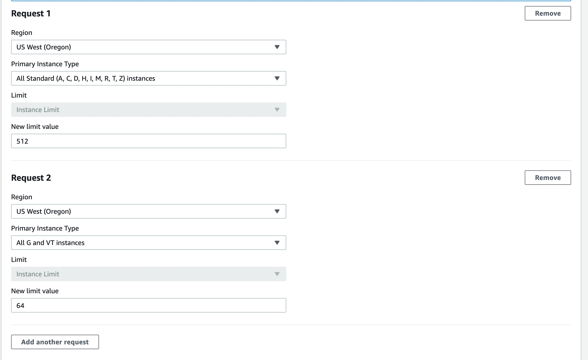

Running integration tests
=========================
# Running Integration Tests against your private fork (Initial setup time: <20 min)
After setting this up, you will be able to make code changes, push to your CWA fork whenever you want, let Github run all the tests against the change automatically.

The integration test GitHub actions workflow installs terraform, builds the agent and uploads the installable packages
to the configured S3 bucket, so all you need to do is configure the secrets in the GitHub repo in order to allow the
actions to run.

## 0. vCPU limit
Newer accounts have lowered default vCPU limits which constrains workflow (eg. running CWAgent GitHub actions on personal forks).  
If you haven't for the choice of your AWS account, do
1. log into your AWS account on a browser
2. go to [here](https://support.console.aws.amazon.com/support/home?#/case/create?issueType=service-limit-increase&limitType=service-code-ec2-instances&serviceLimitIncreaseType=ec2-instances&type=service_limit_increase) 
3. Select Oregon for both request1 & 2
4. For request 1, select All Standard (A, C, D, H, I, M, R, T, Z) instances - new limit 512
5. For request 2, select All G and VT instances - new limit value 64



### Notes
- Integ tests run in parallel and will go over 32 vCPU total limit that is given to you by default. To run everything successfully, your increase limit request needs to be approved.
- If you got approved for 300 instead of 512, that is ok.
- 16 instead of 64 for G and VT instances are ok too. Windows test depend on it.

## 1. Create ECR Repository 
In your account, navigate to us-west-2 and create a ECR repository with the following settings.

|Field              |Value                   |
|-------------------|------------------------|
|Visibility settings|private                 |
|Repository name    |cwagent-integration-test|
|Tag immutability   |disabled                |
|Scan on push       |enabled                 |
|KMS encryption     |disabled                |

## 1. Setup Github personal fork
- Fork amazon-cloudwatch-agent repo
- `git tag <any number>`. e.g. v0 
  - if you use any string, building CWA image will fail during integ test steps with error `'Version' field value 'leechena-1': version number does not start with digit`
- `git push origin --tags` 
  - this is used to create CWAGENT_VERSION which is used by integ test workflow when it builds artifacts. Workflow fails without this.


## 2. Add GPG_KEY_NAME
1. Follow GitHub's [guide](https://docs.github.com/en/authentication/managing-commit-signature-verification/generating-a-new-gpg-key) to create a new gpg key
2. Follow [docs](https://docs.github.com/en/actions/security-guides/encrypted-secrets) to add GPG_KEY_NAME as GitHub repository secret. Name is `GPG_KEY_NAME` and Secret is the `userId` you supplied while creating your gpg key.


### Notes
Build artifacts get signed before being pushed out to S3. This is part of the GitHub actions workflow, so it's not
required for testing locally but is required for testing on your personal fork.

> Note: Store the signing key in a secure location!

## 3. Add PASSPHRASE
1. Follow [docs](https://docs.github.com/en/actions/security-guides/encrypted-secrets) to add PASSPHRASE as GitHub repository secret. Name is `PASSPHRASE` and Secret is the `passphrase` you supplied while creating your gpg key above.


## 4. Add GPG_PRIVATE_KEY
1. `gpg --list-secret-keys --keyid-format=long`
2. An output line should look like `sec <some string>/<key id>`
3. `gpg --export-secret-keys -a <key id> > private.key`  
4. `cat private.key`  
5. copy the entire output including the `----` lines
6. Follow [docs](https://docs.github.com/en/actions/security-guides/encrypted-secrets) to add GPG_PRIVATE_KEY as GitHub repository secret. Name is `GPG_PRIVATE_KEY` and Secret is the private key you just copied to clipboard.


## 5. Add S3_INTEGRATION_BUCKET
1. open your aws console, and navigate into us-west-2 region
2. create bucket
3. bucket name: <bucket-name-of-your-choice>. e.g. terraform-integ-test
4. Don't change any other default s3 bucket configuration. Just create with the bucket name.
5. Follow [docs](https://docs.github.com/en/actions/security-guides/encrypted-secrets) to add S3_INTEGRATION_BUCKET as GitHub repository secret. Name is `S3_INTEGRATION_BUCKET` and Secret is the `<bucket-name-of-your-choice>`


## 6. Add TERRAFORM_AWS_ASSUME_ROLE
1. Navigate to CloudFormation from aws console
2. Choose file upload.
3. Upload the following as a file
```
Parameters:
  GitHubOrg:
    Type: String
  RepositoryName:
    Type: String
  OIDCProviderArn:
    Description: Arn for the GitHub OIDC Provider.
    Default: ""
    Type: String

Conditions:
  CreateOIDCProvider: !Equals 
    - !Ref OIDCProviderArn
    - ""

Resources:
  Role:
    Type: AWS::IAM::Role
    Properties:
      AssumeRolePolicyDocument:
        Statement:
          - Effect: Allow
            Action: sts:AssumeRoleWithWebIdentity
            Principal:
              Federated: !If 
                - CreateOIDCProvider
                - !Ref GithubOidc
                - !Ref OIDCProviderArn
            Condition:
              StringLike:
                token.actions.githubusercontent.com:sub: !Sub repo:${GitHubOrg}/${RepositoryName}:*

  GithubOidc:
    Type: AWS::IAM::OIDCProvider
    Condition: CreateOIDCProvider
    Properties:
      Url: https://token.actions.githubusercontent.com
      ClientIdList: 
        - sts.amazonaws.com
      ThumbprintList:
        - 6938fd4d98bab03faadb97b34396831e3780aea1

Outputs:
  Role:
    Value: !GetAtt Role.Arn 
```

4. the UI should ask you for inputs for the parameters. In `GitHubOrg`, type in your github username. In `RepositoryName`, type in your fork repo's name. e.g. amazon-cloudwatch-agent
5. Choose a stackname. Anything. e.g. Terraform-IntegTest-Role
6. After creating the stack, navigate to IAM console
7. Search for an IAM role with the stack name you chose above. e.g. Terraform-IntegTest-Role...
8. Click add permission
9. Click attach policy, and then click create policy.
10. Click JSON tab and copy and paste the following

```json
{
  "Version": "2012-10-17",
  "Statement": [
    {
      "Effect": "Allow",
      "Action": [
        "ec2:CreateTags",
        "ec2:DescribeAccountAttributes",
        "ec2:DescribeImages",
        "ec2:DescribeInstanceAttribute",
        "ec2:DescribeInstanceCreditSpecifications",
        "ec2:DescribeInstances",
        "ec2:DescribeTags",
        "ec2:DescribeVolumes",
        "ec2:DescribeVpcs",
        "ec2:GetPasswordData",
        "ec2:ModifyInstanceAttribute",
        "dynamodb:*",
        "ec2:RunInstances",
        "ec2:TerminateInstances",
        "s3:ListBucket",
        "s3:GetObject",
        "s3:GetObjectAcl",
        "s3:PutObject",
        "sts:GetCallerIdentity",
        "ssm:PutParameter",
        "ssm:DeleteParameter",
        "ssm:DescribeParameters",
        "ssm:ListTagsForResource",
        "ssm:GetParameters",
        "ssm:GetParameter",
        "ssm:DeleteParameters",
        "ecs:ListContainerInstances",
        "ecs:ListClusters",
        "ecs:ListServices",
        "ecs:ListTasks",
        "ecs:ListTaskDefinitions",
        "ecs:DescribeClusters",
        "ecs:DescribeServices",
        "ecs:DescribeTasks",
        "ecs:ListTagsForResource",
        "ecs:CreateCluster",
        "ecs:CreateService",
        "ecs:CreateTaskSet",
        "ecs:DeleteCluster",
        "ecs:DeleteService",
        "ecs:DeleteTaskSet",
        "ecs:RunTask",
        "ecs:StartTask",
        "ecs:StopTask",
        "ecr:GetAuthorizationToken",
        "ecr:DescribeRepositories",
        "ecr:ListImages",
        "ecr:DescribeImages",
        "ecr:ListTagsForResource",
        "ecr:InitiateLayerUpload",
        "ecr:UploadLayerPart",
        "ecr:CompleteLayerUpload",
        "ecr:PutImage",
        "ecr:BatchCheckLayerAvailability",
        "ecr:BatchGetImage",
        "ec2:DescribeVpcAttribute",
        "ec2:DescribeSubnets",
        "ec2:DescribeRouteTables",
        "ec2:CreateSecurityGroup",
        "ec2:ImportKeyPair",
        "ec2:CreateTags",
        "ec2:DescribeSecurityGroups",
        "ec2:DescribeKeyPairs",
        "ec2:RevokeSecurityGroupEgress",
        "ec2:DescribeNetworkInterfaces",
        "ec2:AuthorizeSecurityGroupIngress",
        "ec2:DeleteSecurityGroup",
        "ec2:AuthorizeSecurityGroupEgress",
        "logs:CreateLogGroup",
        "logs:DescribeLogGroups",
        "logs:ListTagsLogGroup",
        "iam:CreateRole",
        "iam:CreatePolicy",
        "iam:GetRole",
        "iam:GetPolicy",
        "iam:GetPolicyVersion",
        "iam:ListRolePolicies",
        "iam:ListAttachedRolePolicies",
        "iam:CreateInstanceProfile",
        "iam:AttachRolePolicy",
        "iam:GetInstanceProfile",
        "iam:AddRoleToInstanceProfile",
        "iam:PassRole",
        "ec2:RunInstances",
        "ec2:DescribeInstanceTypes",
        "iam:DetachRolePolicy",
        "iam:RemoveRoleFromInstanceProfile",
        "ec2:DeleteKeyPair",
        "iam:ListPolicyVersions",
        "iam:DeleteInstanceProfile",
        "iam:DeletePolicy",
        "iam:ListInstanceProfilesForRole"
      ],
      "Resource": "*"
    }
  ]
}
```
11. Once creation is done, go back to the IAM role and attach the policy you just created by searching for the policy name.
12. Follow [docs](https://docs.github.com/en/actions/security-guides/encrypted-secrets) to add TERRAFORM_AWS_ASSUME_ROLE as GitHub repository secret. Name is `TERRAFORM_AWS_ASSUME_ROLE` and Secret is the IAM role name. 


### Notes
[reference of how to create role](https://github.com/aws-actions/configure-aws-credentials)

## 7. Run the integration test action on your fork

1. Navigate to your fork
2. Go to `Actions`
3. Select the `Run Integration Tests` action
4. Select `Run workflow`, and choose the branch to execute integration tests on

> Note: The Amazon EC2 quota limit might need to be increased to run the integration test (each EC2 integration test suite is tested on different EC2 instance per OS)
> : request an increase via `All Standard (A, C, D, H, I, M, R, T, Z) Spot Instance Request`

Note that based on the GitHub action workflow YAML configuration, merges to the main branch
also trigger the integration tests. If for any reason you do not want integration tests to run
on merge for your fork, you should go to `Actions`, select the `Run Integration Tests` action,
click the `...` and then select `Disable workflow`. 
See [GitHub docs](https://docs.github.com/en/actions/managing-workflow-runs/disabling-and-enabling-a-workflow)
regarding how to turn workflows on and off.

# Local setup (Not recommended)

### Install terraform

Install `terraform` on your local machine ([download](https://www.terraform.io/downloads)).

### Build and upload agent artifacts

1. Run `make release` to test, build, and generate agent artifacts that can be installed and tested.
    1. If targeting a specific OS, you can run a more specific make command. `make build && make package-deb` would
       build and package for Ubuntu.
2. Copy the artifacts to the test S3
   bucket: `aws s3 cp ./build/bin s3://{your bucket name}/integration-test/binary/{commit SHA} --recursive`
    2. Substitute out the values wrapped in `{}` with what you have for testing

### Start localstack

Navigate to the localstack terraform directory, initialize Terraform and apply the tf plan:

```shell
cd ./integration/terraform/ec2/localstack
terraform init
terraform apply --auto-approve \
         -var="github_repo=${gh repo you want to use ex https://github.com/aws/amazon-cloudwatch-agent.git}" \
         -var="github_sha=${commit sha you want to use ex fb9229b9eaabb42461a4c049d235567f9c0439f8}" \
         -var='vpc_security_group_ids=["${name of your security group}"]' \
         -var="ssh_key_name=${name of key pair your created}" \
         -var="s3_bucket=${name of your s3 bucket created}" \
         -var="iam_instance_profile=${name of your iam role created}" \
         -var="ssh_key_value=${your key that you downloaded}"
```

> See the list of parameters or table of GitHub secret params as reference

Write down the public DNS output from executing the terraform plan.

Expected output:

```
aws_instance.integration-test: Creation complete after 1m47s [id=i-03e33419d42b90325]

Apply complete! Resources: 1 added, 0 changed, 0 destroyed.

Outputs:

public_dns = "ec2-35-87-254-148.us-west-2.compute.amazonaws.com"
ec2-35-87-254-148.us-west-2.compute.amazonaws.com
Completed 7.0 KiB/7.0 KiB (16.5 KiB/s) with 1 file(s) remaining
upload: ./terraform.tfstate to s3://***/integration-test/local-stack-terraform-state/1bc666bc04255402d4516a008bb1095c5d4d27b7/terraform.tfstate
```

In this example, you should keep track of `ec2-35-87-254-148.us-west-2.compute.amazonaws.com`

### Start the linux integration tests (example):

```shell
cd ../linux # assuming you are still in the ./integration/terraform/ec2/localstack directory
terraform init
terraform apply --auto-approve \
         -var="github_repo=${gh repo you want to use ex https://github.com/aws/amazon-cloudwatch-agent.git}" \
         -var="github_sha=${commit sha you want to use ex fb9229b9eaabb42461a4c049d235567f9c0439f8}" \
         -var='vpc_security_group_ids=["${name of your security group}"]' \
         -var="s3_bucket=${name of your s3 bucket created}" \
         -var="iam_instance_profile=${name of your iam role created}" \
         -var="ssh_key_name=${name of key pair your created}" \
         -var="ami=${ami for test you want to use ex cloudwatch-agent-integration-test-ubuntu*}" \
         -var="user=${log in for the ec2 instance ex ubuntu}" \
         -var="install_agent=${command to install agent ex dpkg -i -E ./amazon-cloudwatch-agent.deb}" \
         -var="ca_cert_path=${where the default cert on the ec2 instance ex /etc/ssl/certs/ca-certificates.crt}" \
         -var="arc=${what arc to use ex amd64}" \
         -var="binary_name=${binary to install ex amazon-cloudwatch-agent.deb}" \
         -var="local_stack_host_name=${dns value you got from the local stack terraform apply step}" \
         -var="test_name=${what you want to call the ec2 instance name}" \
         -var="ssh_key_value=${your key that you downloaded}"
```

> See the list of parameters or table of GitHub secret params as reference

You should see tests being run on the remote hosts, like so:

```
aws_instance.integration-test (remote-exec): --- PASS: TestBundle (243.28s)
aws_instance.integration-test (remote-exec):     --- PASS: TestBundle/resource_file_location_resources/integration/ssl/with/combine/bundle_find_target_false (60.55s)
aws_instance.integration-test (remote-exec):     --- PASS: TestBundle/resource_file_location_resources/integration/ssl/without/bundle/http_find_target_false (60.55s)
aws_instance.integration-test (remote-exec):     --- PASS: TestBundle/resource_file_location_resources/integration/ssl/with/original/bundle_find_target_true (61.06s)
aws_instance.integration-test (remote-exec):     --- PASS: TestBundle/resource_file_location_resources/integration/ssl/without/bundle_find_target_true (61.13s)
aws_instance.integration-test (remote-exec): PASS
aws_instance.integration-test (remote-exec): ok  	github.com/aws/amazon-cloudwatch-agent/integration/test/ca_bundle	243.288s
aws_instance.integration-test (remote-exec): === RUN   TestEmpty
aws_instance.integration-test (remote-exec): --- PASS: TestEmpty (0.00s)
aws_instance.integration-test (remote-exec): PASS
aws_instance.integration-test (remote-exec): ok  	github.com/aws/amazon-cloudwatch-agent/integration/test/empty	0.002s
aws_instance.integration-test (remote-exec): === RUN   TestAgentStatus
aws_instance.integration-test: Still creating... [5m30s elapsed]
aws_instance.integration-test (remote-exec): --- PASS: TestAgentStatus (6.54s)
aws_instance.integration-test (remote-exec): PASS
aws_instance.integration-test (remote-exec): ok  	github.com/aws/amazon-cloudwatch-agent/integration/test/sanity	6.541s
aws_instance.integration-test: Creation complete after 5m35s [id=i-0f7f77a62c93df010]

Apply complete! Resources: 1 added, 0 changed, 0 destroyed.   
```

### Start the Windows integration tests (example): 
```shell
cd ../linux # assuming you are still in the ./integration/terraform/ec2/localstack directory
terraform init
terraform apply --auto-approve \
         -var="github_repo=${GH repo you want to use. Default: https://github.com/aws/amazon-cloudwatch-agent.git}" \
         -var="github_sha=${Commit sha you want to use. Default: a029f69cd3b4164cb601cfa20f10b717c5f85957}" \
         -var="s3_bucket=${Name of your s3 bucket created}" \
         -var="ami=${AMI for test you want to use. Default: cloudwatch-agent-integration-test-win-2022*}" \
         -var="test_name=${What you want to call the ec2 instance name. Default: windows-2022}" \
         -var="ssh_key_name=${Name of key pair your created}" \
         -var="ssh_key_value=${Your key that you downloaded}"
```

For these parameters, you are **not required to input them**:
* github_repo
* github_sha
* ssh_key_name
* ssh_key_value
* ami
* test_name

After running the tests, you should see the following results as a success integration test:
```
null_resource.integration_test: Still creating... [1m30s elapsed]
null_resource.integration_test: Still creating... [1m40s elapsed]
null_resource.integration_test: Still creating... [1m50s elapsed]
null_resource.integration_test: Still creating... [2m0s elapsed]
null_resource.integration_test (remote-exec): === RUN   TestAgentStatus
null_resource.integration_test: Still creating... [2m10s elapsed]
null_resource.integration_test: Still creating... [2m20s elapsed]
null_resource.integration_test: Still creating... [2m30s elapsed]
null_resource.integration_test: Still creating... [2m40s elapsed]
null_resource.integration_test: Still creating... [2m50s elapsed]
null_resource.integration_test (remote-exec): --- PASS: TestAgentStatus (44.84s)
null_resource.integration_test (remote-exec): PASS
null_resource.integration_test (remote-exec): ok        github.com/aws/amazon-cloudwatch-agent/integration/test/sanity  45.203s
null_resource.integration_test: Creation complete after 2m52s [id=8591283884920986776]
```

### Destroy resources created by Terraform

After running tests, tear down everything with Terraform:

```shell
# assuming still in the ./integration/terraform/ec2/linux directory
terraform destroy --auto-approve
cd ../localstack
terraform destroy --auto-approve
```

# How are AMIs built?

1. AMI builder pipeline builds the ami
2. The pipeline installs required packages and updates ami software
3. This process generates a new ami we can then use for testing

## Instance software assumptions

1. docker
    1. starts on start up
    2. does not require sudo
2. docker-compose
3. golang
4. openssl
5. git
6. make
7. aws-cli
8. CloudWatchAgentServerRole is attached
9. crontab
10. gcc
11. python3
