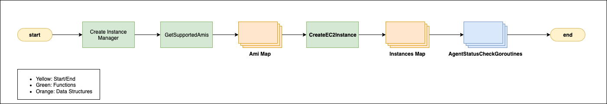

# Uniform Build Enviorment

RemoteBuildManager
InstanceManager
## EC2 Instance Generation

## Building CWA Remotely

## Custom Command 

0aa349f04d9ea7346

## FAQ
- Q: Why are we running commands as one giant command instead of individual ones?
- A: It ensures concurrency. Basically, if I run commands individually I cannot control their deployment unless I check before creating every command which is inefficient. This way I create these big "atomic" command that cannot be interrupted by another command.
- Q: 