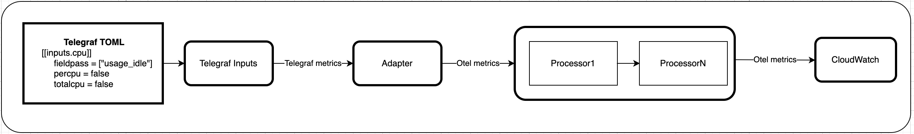

# Adapter Receiver

The Adapter Receiver receives Telegraf metrics, filters unsupported value
and converts them to corresponding OTEL metrics before passing down to
OTEL processors and exporters. This is intended to be used when Telegraf 
input plugins are still intact.

| Status                   |                          |
| ------------------------ |--------------------------|
| Stability                | [stable]                 |
| Supported pipeline types | metrics                  |
| Distributions            | [amazon-cloudwatch-agent]|


## Architectural


## Data Conversion
Convert Telegraf Metrics with the following type (Counter, Gauge, or Untyped) 
```
Metric {
    Name
    TagList (each tag with key, value)
    FieldList (each field with key, value) 
    Time
    Type (Counter, Gauge, Summary, Histogram, or Untyped)
}
```

to OpenTelemetry ```Int64DataPoints```, ```DoubleDataPoints``` metrics datapoints
```
Metrics {
    ResourceMetrics: list of {
      Resource: {
        Attributes: map of {key: value}
      }
      InstrumentationScopeMetrics: list of {
        InstrumentationLibrary: {Name, Version}
        Metrics: list of {
          Name
          Description
          Unit
          DataType (None, Gauge, Sum, Histogram, Summary)
          depending on DataType, e.g. Gauge: {
            DataPoints: list of {
              Attributes: map of {key: value}
              Timestamp
              Type (None, Int, Double)
              Val
            }
          }
        }
      }
    }
  }
```

## Receiver Configuration

The following receiver configuration parameters are supported.
| Name                | Description                                                                                                   | Default |
|---------------------| --------------------------------------------------------------------------------------------------------------|---------|
|`collection_interval`| is the option to set the collection interval for each plugin                                                  | "1m"    |
|`alias_name`         | is the option to set the different name for each plugin.                                                      | ""      |         